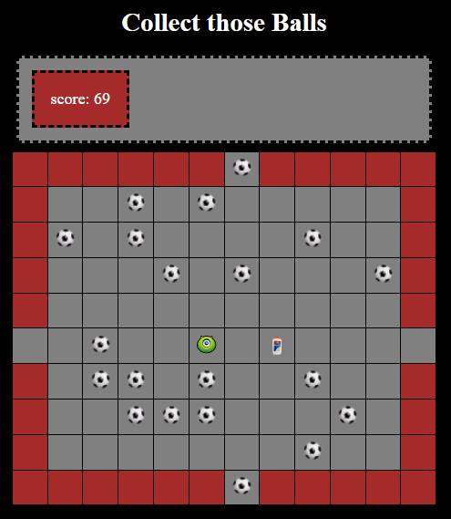

# Ball-Board
> Nice little board game exercise.

## General Information
This project is a small JavaScript exercise intended to practice JS CSS and HTML integration while creating a small scale web-game with a matrix data model. This is one of the first exercises performed as part of the Coding Academy web development course.

## Technologies Used
- HTML5
- CSS3
- JavaScript - ES6

## Screenshots

## Usage
- Use the arrow-keys or mouse click near your player in order to move.
- Capture all the soccer balls to win the game!
- Avoid the glue! 
- You can jump to the oposite side of the board by exiting from any side. 
- If the soccer balls fill the entire board you lose.

## Project Status
Project is: _no longer being worked on_.  
Reason: Moved to work on higher scale projects.

## Room for Improvement
- Fix a bug with the glue capturing immediately after ball capturing.
- Add more features.
- Improve style.
